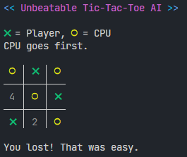

# Unbeatable Tic-Tac-Toe AI



There is no way you can beat this no-dependencies terminal-based Tic-Tac-Toe AI. You should not try as you are not good enough.

Do you really want to take on the challenge? Can you stop the next generation of artificial intelligence from taking over the world?

## Prerequisites

- Must have Node.js installed and available in your path
- Must be ready to lose

## Installation and usage

1. Clone this repository
2. `cd` into the project folder
3. Run the following command:

```shell
$ node index.js <first_player> <number_mode>
```

Both arguments are not required.

### `first_player`

Controls who is the first player. Can be one of:

- `player` (_default_)  
  The player goes first.
- `cpu`  
  The AI goes first.

### `number_mode`

Controls the number mapping of the board. Can be one of:

- `normal` (_default_)  
  Number 1 in the top left, going left-to-right, top-to-bottom.
- `reverse`  
  Number 1 in the bottom left, going left-to-right, bottom-to-top.  
  This mode is very useful if using a number pad to play.

## Serious description

Tic-Tac-Toes is a pretty simple game. There is no actual AI involved, as every possible state can be easily handled.

The "AI" uses a single method to compute the next best move based on the current board state, following a [very simple algorithm](#implementation-details). This algorithm does not use the typical minimax strategies, and instead relies on pattern matching (or something close, as the real deal is not available in JavaScript) to produce a better board every time.

It is guaranteed that the CPU will always choose the best possible move, causing it to always win the game.

If the player also plays in the best possible way, the game will always result in at most a draw.

### Implementation details

The algorithm follows these simple rules for each CPU turn:

- If there is any pair of CPU's symbols that can turn into a three-of-a-kind in a single move, pick that move and win
- Otherwise, if there is any pair of player's symbols that can turn into a three-of-a-kind in the next move, block it
- Otherwise, if no corner is used, pick any one
- Otherwise, if there is a corner already picked by the CPU and the opposite is open, pick it
- Otherwise, if there a corner already picked by the player and the opposite is open, pick it
- Otherwise, if there is a corner already picked by the CPU and one adjacent is open, pick it
- Otherwise, if there are any spots left, the board will inevitably lead to a draw, so pick any spot

## FAQ

### I found a board state that your AI cannot handle!

That's totally possible, as this project has been tied together in just a couple of hours.

If you ever find yourself with the game screaming at you about being unable to find a move, please open an issue including the error code that is given to you and that specific case will be handled as soon as possible.

### Why did you include a win check for the player if the AI is unbeatable?

If you ever manage to beat this advanced piece of technology without resorting to code modifications, memory manipulation or gamma rays, then welcome! We are looking for you in preparation of the war against the machines. Thank you for helping us help you help us all.

### Can I contribute?

As this AI is already ascended to perfection levels, there is probably no work left to do. However, you may do as you please and PRs are always welcome.

### lol this is not ai you pickle

lol i know right

## Disclaimer

This game (and this readme) is made to be ironic, as if making a Tic-Tac-Toe AI is a very difficult task (it's not) and will mock you for losing every time.

If you have the feeling you could be offended by this, please restrain from trying it yourself and meditate on the fact that we are even talking about this.
